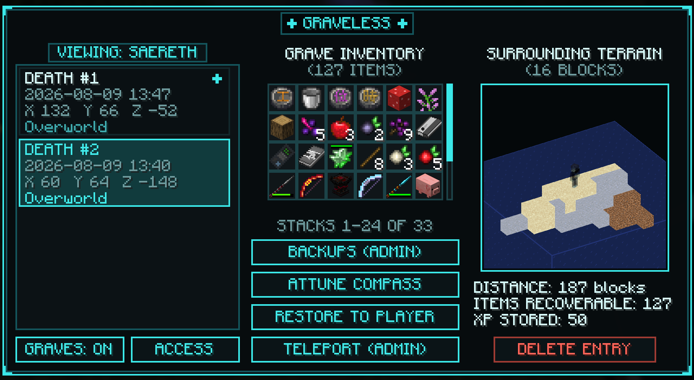
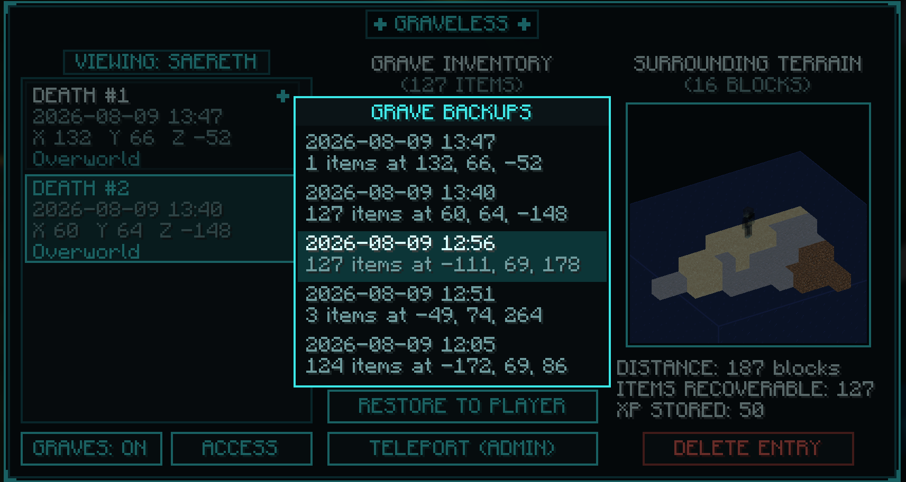

# Graveless

Death in Minecraft usually means watching your items burn in the lava that killed you, or turning on keepInventory and losing the tension that makes the game fun. Graveless is the middle path. When you die, your belongings are kept safe at the place you fell, and a ghost of your own character waits there for you to come reclaim them.

There is no grave block to break, no chest to dig up, and nothing that can be destroyed, buried, or lost. Your items are held by the world itself until you come back for them.

## Your ghost is waiting for you

When you die anywhere a spectral copy of you, wearing your own skin, appears at the spot and is visible only to you and those you give permission to. A tall pillar of light rises above it so you can spot it from hundreds of blocks away, and a glowing outline shows through terrain as you get closer. Walk toward it and a single silver thread reaches out from the ghost's heart to yours, guiding you the last stretch.

When you are close enough, a whisper tells you your spirit is within reach, how far away it lingers, and which direction to walk. Look at the ghost and click. That's all you have to do.

- Items return to the exact slots they were in when you died. Your pickaxe is back on the same hotbar slot, your armor is back on your body, your offhand is back in your offhand and your curios are in the slot you assigned them to.
- Your experience comes back too.
- If your bags are already partly full, the ghost keeps whatever does not fit. Come back with space and claim the rest. Nothing is ever thrown on the ground or lost.
- Sneak and click instead of clicking, and the grave opens in the browser with that death selected, so you can pick through it stack by stack rather than taking everything at once.

## Don't fear the reaper

Corpse runs are miserable when the thing that killed you is still waiting there. As you approach your own grave a Spirit Ward settles over you. You turn invisible, monsters ignore you completely, and night vision lets you see into whatever dark place you died in. The ward holds for up to two minutes, long enough to walk in, take back what is yours, and walk out. Once you claim your grave it fades quickly though, so you'll need to get out quick. The ward is off by default. Turn it on in the config, where you can also tune its duration and range.

## The Spirit Compass

Every death places a Spirit Compass in your hand when you respawn. Its needle points across the world toward your grave. It disappears on its own once you have nothing left to recover, and a fresh one arrives with every death so you wont end up with multiple of them cluttering your inventory for multiple deaths. It never takes up space in your grave and it can never be lost with your other belongings.

Right click the compass to commune with your graves and select the one you want to track and live preview its location and contents.

## Browse your deaths

The compass (or the `/graveless` command) opens a view of every outstanding grave you have. For each one you can see:

- When and where you died, and what killed you
- Every item waiting in the grave, down to the stack counts
- A miniature 3D diorama of the terrain around your ghost, with your ghost standing in it, so you know whether you are walking into a cave, a shoreline, or the middle of a lava lake. Drag to rotate it, scroll to zoom.
- How far away it is, and how much experience is stored

You can also attune your Spirit Compass to any grave in the list, if the one you want back first is not the most recent. The same screen manages who may see your graves and your personal graves on/off switch, so you never need to memorize a command.

Standing at the ghost, the browser becomes a way to take your death apart piece by piece. Sneak and left click any slot to pull that stack into your inventory, reclaim the stored experience on its own, and delete the entry once whatever is left is something you would rather not carry. That is the answer to picking up a block that irradiates you, a cursed item, or anything else you want gone without giving up the rest of your gear. Taking single stacks needs you to be within claim range of the ghost, so the compass alone will not empty a grave from across the world.

## Bring friends, or don't

Your graves are yours. Other players cannot see your ghost, cannot loot your items, and cannot even tell where you died. If you want help recovering something dangerous, grant a friend access right from the grave browser (or with a command), and they can claim your grave for you, or stand at it and hand back one stack at a time. Only you and server staff can delete a grave outright. Revoke access just as easily.

Prefer the old ways? Turn Graveless off for yourself entirely and your items will drop on death like vanilla, no questions asked. Each player on a server can decide
if they want this feature enabled or not.

## Nothing is ever lost

Graveless was built around one promise; your items survive. A few of the ways the mod tries to keeps that promise are:

- Graves never expire. Log in a month later and your ghost is still waiting.
- Items from other mods are captured too, including equipped Curios accessories, which return to the exact accessory slots they came from.
- Strange modded items with oversized stacks or broken data cannot corrupt your graves. They are corrected on capture, and even an unreadable item only costs that one item, never the rest of the grave.
- Deaths in the void leave the ghost floating at a reachable height instead of at the bottom of the world.
- Every death is also written to a permanent backup on the server, and staff can revive any backup as a fresh grave in a couple of clicks, even for graves that were already claimed or deleted.
- Server operators get the full toolkit in the same browser: view any player's graves, preview the exact contents, restore everything remotely, pull out a single item, teleport to the site, or bring back a backup.

## Commands

Almost everything lives in the grave browser, but every action has a command too, which is handy for console use or players who are offline.

| Command | What it does |
|---|---|
| `/graveless` | Open the grave browser |
| `/graveless allow <player>` | Let a friend see and claim your graves |
| `/graveless deny <player>` | Take that permission back |
| `/graveless clear` | Remove everyone from your access list |
| `/graveless disable` / `enable` | Opt out of graves (vanilla drops) or back in |
| `/graveless list` | List your graves in chat |
| `/graveless restore <player>` | Operators: restore a grave to a player from anywhere |
| `/graveless backups <player>` | Operators: list a player's death backups |
| `/graveless restorebackup <player> <#>` | Operators: revive a backup as a live grave |
| `/graveless prune player <player> [keep]` | Operators: delete a player's oldest backup files |
| `/graveless prune all [keep]` | Operators: do the same for everyone on the server |

## For server owners

Everything meaningful is configurable. The defaults:

| Setting | Default |
|---|---|
| Graves kept per player | 30, oldest dropped first |
| Archived backups kept per player | Unlimited (`-1`). Set a number to cap the folder on disk |
| Ghost visibility range | 256 blocks |
| Claim range | 16 blocks, working through walls unless you enable the line of sight requirement |
| Spirit Ward | Off. Turn it on to be granted the ward within 256 blocks of your own grave |
| Spirit Ward duration | 2 minutes, fading 1 second after you claim |

Running keepInventory? Graveless respects the gamerule and stays out of the way, and players who prefer vanilla drops can opt out individually.

Every death also writes a backup file under `world/graveless/<uuid>/`. Those files are never removed by claiming or
deleting a grave, so on a long-running server the folder only grows. Set `max_backups_per_player` to cap it: the
oldest files are deleted as soon as a new death pushes a player over the limit. `/graveless prune` applies the same
limit on demand, or a one-off limit if you pass a keep count.

## Requirements

Minecraft 1.21.1 on either NeoForge or Fabric. Works in singleplayer and on servers.

| Loader | Jar | Also needs |
|---|---|---|
| NeoForge | `graveless-neoforge-<mc>-<version>.jar` | nothing |
| Fabric | `graveless-fabric-<mc>-<version>.jar` | Fabric API, Forge Config API Port |

Curios is supported on NeoForge when present.

## License

MIT. See [LICENSE.md](LICENSE.md).
